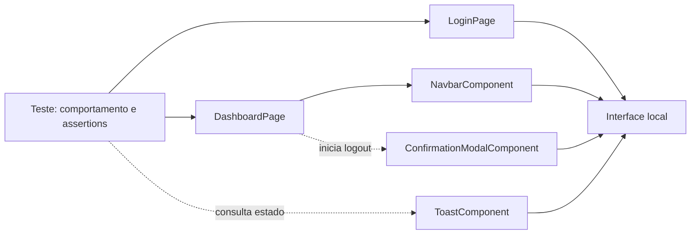

# Fluxo com Page Objects

O teste descreve o comportamento esperado e mantém as assertions visíveis. Pages encapsulam telas completas; Components encapsulam partes reutilizáveis. Nenhuma abstração decide se o teste passou.
