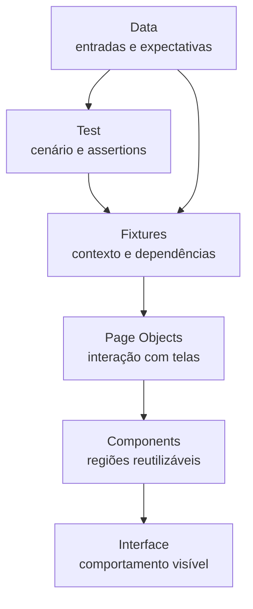

# Engenharia de Automação com Playwright

## Capítulo 7 — Trabalhando com Fixtures

**Status:** ✅ Publicado
**Nível:** Intermediário  
**Pré-requisitos:** Capítulos 1 a 6  
**Objetivo:** organizar contexto, dependências e preparação sem esconder o comportamento dos testes.

---

## Objetivo

Page Objects organizam a interação com a interface. Fixtures organizam o contexto e as dependências necessárias para executar os testes. Este capítulo refatora dois cenários autenticados sem transformar a fixture em uma abstração da aplicação inteira.

## O problema

No [`before`](../examples/fixtures/before/), cada cenário instancia as Pages, seleciona o usuário, abre a tela e faz login. A duplicação é intencional e ainda legível, mas cresce a cada cenário autenticado:

```ts
const loginPage = new LoginPage(page);
const dashboardPage = new DashboardPage(page);
const user = users.qa;

await loginPage.goto();
await loginPage.login(user.email, user.password);
```

Um `beforeEach` poderia remover parte da repetição, mas exigiria variáveis externas ao teste e aplicaria a preparação a todos os casos daquele bloco. Queremos dependências nomeadas, tipadas e ativadas sob demanda.

## Before vs After

No Before, preparação e comportamento dividem o teste. No [`after`](../examples/fixtures/after/), os mesmos cenários declaram que precisam de `authenticatedUser`:

```ts
test('opens the authenticated user profile', async ({ authenticatedUser }) => {
  const { dashboardPage, user } = authenticatedUser;
  await dashboardPage.openProfile();
  await expect(dashboardPage.profileEmail).toHaveText(user.email);
});
```

A assertion principal permanece visível. A fixture não testa a tela; ela entrega o contexto necessário.

## O que é uma Fixture no Playwright

Fixture é uma dependência gerenciada pelo runner. Ela pode criar um objeto, preparar estado, depender de outras fixtures e desmontar recursos ao fim do uso. Fixtures existem para oferecer composição, isolamento, tipagem e ciclo de vida a dependências de teste.

Pense nelas como injeção de dependências para testes, não como uma pasta genérica para código compartilhado.

## `test.extend()` e Fixtures tipadas

Partimos do `test` do Playwright e declaramos o contrato em TypeScript:

```ts
type TestFixtures = {
  loginPage: LoginPage;
  dashboardPage: DashboardPage;
  user: TestUser;
  authenticatedUser: AuthenticatedUser;
};

export const test = base.extend<TestFixtures>({
  loginPage: async ({ page }, use) => {
    await use(new LoginPage(page));
  },
});
```

O genérico de `extend` faz o editor conhecer os nomes e tipos disponíveis. Um teste importa esse `test` estendido, não o `test` base.

## `use()`, setup e teardown

`use()` entrega o recurso ao teste e marca a fronteira do ciclo de vida:

```ts
authenticatedUser: async ({ page, loginPage, dashboardPage, user }, use) => {
  // setup
  await loginPage.goto();
  await loginPage.login(user.email, user.password);

  await use({ user, dashboardPage });

  // teardown
  await page.setContent('<!doctype html><title>Contexto encerrado</title>');
},
```

Antes de `use()` ocorre o setup. Enquanto `use()` está ativo, o teste usa o recurso. O código posterior executa na desmontagem, inclusive quando o teste falha. Neste ambiente local, a limpeza troca o documento; em projetos reais, o teardown poderia encerrar uma conexão ou remover um recurso temporário.

## Dependência e composição de Fixtures

Os nomes desestruturados no primeiro parâmetro são dependências. `authenticatedUser` compõe `loginPage`, `dashboardPage` e `user`; o Playwright resolve a ordem e desmonta em ordem inversa.

Composição não exige uma cadeia longa. Neste capítulo, uma única extensão mantém a relação visível. Em uma base maior, extensões de domínios diferentes podem ser combinadas com `mergeTests`, desde que a separação represente fronteiras reais.

Fixtures explícitas só são ativadas quando um teste ou outra fixture as solicita. Uma fixture automática usa a opção `{ auto: true }` e roda sem aparecer na assinatura. Isso é útil para preocupações realmente transversais, como anexar diagnóstico, mas pode esconder custo e comportamento; prefira a forma explícita.

## Fixtures + Page Objects + Components + Data



- Page Object concentra locators e ações de uma tela.
- Component representa uma região reutilizável da interface.
- Fixture cria, combina e gerencia dependências.
- Hook coordena uma etapa comum dentro de um grupo de testes.
- Helper executa uma função reutilizável sem injeção nem ciclo de vida gerenciado.
- Data descreve entradas e resultados esperados; não executa preparação.

As Pages locais repetem apenas o mínimo do Capítulo 6 para manter o exemplo independente. Não há Component novo porque a interface deste capítulo não possui uma região reutilizável que justifique essa abstração.

## Fixtures + dados de teste

Os dados vivem em `data/users.data.ts`, não escondidos na fixture. A fixture `user` seleciona e entrega um valor tipado; autenticação usa esse valor. Assim, dados continuam substituíveis e localizáveis.

Para variações orientadas a casos, muitas vezes é mais claro importar os dados diretamente no teste e parametrizá-lo. Crie uma fixture de dados quando ela fizer parte do contexto injetado, não apenas para evitar um `import`.

## Escopo por teste vs escopo por worker

O escopo padrão é `test`: cada teste recebe uma instância isolada. É adequado para `page`, Page Objects, usuário mutável e qualquer estado que um teste possa alterar.

Uma fixture com `scope: 'worker'` nasce uma vez por processo worker e é compartilhada pelos testes executados nele. O tipo do worker fica no segundo genérico:

```ts
type WorkerFixtures = { buildLabel: string };

const test = base.extend<TestFixtures, WorkerFixtures>({
  buildLabel: [async ({}, use) => {
    await use('local-demo');
  }, { scope: 'worker' }],
});
```

Use worker scope apenas para recursos caros, seguros para compartilhamento e independentes do estado de um teste. Uma fixture de worker não pode depender de uma fixture de teste. Não adicionamos esse código ao exemplo executável porque uma string constante não precisa de ciclo de vida: seria overengineering apenas para demonstrar sintaxe.

## Fixture não é sinônimo de `beforeEach`

`beforeEach` é adequado quando todos os testes de um `describe` precisam da mesma etapa simples e local, como navegar para uma rota. Hooks deixam clara a ordem dentro daquele grupo e não são antipadrão.

Fixture é melhor quando a preparação representa uma dependência nomeada, precisa ser reutilizada em arquivos diferentes, compor outras dependências, possuir teardown próprio ou ser solicitada apenas por certos testes.

Evite usar um hook para preencher variáveis mutáveis declaradas fora dos testes. E evite converter todo hook legível em fixture: escolha pelo ciclo de vida e pela necessidade de composição.

## Fixture vs helper

Um helper é uma função comum chamada diretamente, ideal para transformação ou ação sem recurso gerenciado:

```ts
const formatUserName = (name: string) => name.trim().toUpperCase();
```

Uma fixture participa da resolução de dependências e envolve o teste com setup/teardown. Se uma função só recebe valores e devolve um resultado, um helper costuma ser mais simples.

## Quando NÃO criar uma Fixture

- quando um `import` ou helper resolve a necessidade;
- quando a preparação só aparece uma vez e já é clara;
- para armazenar constantes sem ciclo de vida ou composição;
- para esconder ações importantes do cenário;
- para centralizar responsabilidades não relacionadas;
- para executar assertions que pertencem ao teste.

## Boas práticas

- use nomes que revelem o contexto entregue;
- mantenha dependências explícitas na assinatura;
- tipifique o valor fornecido por `use()`;
- mantenha fixtures pequenas e focadas;
- escolha o menor escopo seguro, normalmente `test`;
- deixe dados em módulos próprios;
- mantenha ações nas Pages e assertions nos testes;
- faça teardown somente do recurso que a fixture criou.

## Erros comuns e sinais de overengineering

- fixture gigante que prepara a aplicação inteira;
- responsabilidades não relacionadas no mesmo ciclo de vida;
- autenticação “mágica” impossível de localizar;
- dependências ocultas e fixtures automáticas sem necessidade;
- cadeia excessiva de fixtures;
- dados fixos espalhados nas fixtures;
- assertions escondidas durante o setup;
- transformar toda função auxiliar em fixture;
- compartilhar estado mutável em worker scope.

## Estrutura do exemplo

```text
examples/fixtures/
├── README.md
├── before/
│   ├── README.md
│   └── authenticated-user.example.ts
└── after/
    ├── README.md
    ├── data/users.data.ts
    ├── fixtures/test.fixture.ts
    ├── pages/login.page.ts
    ├── pages/dashboard.page.ts
    └── tests/
        ├── dashboard.example.ts
        └── profile.example.ts
```

Os `.example.ts` são compilados pelo TypeScript, mas ficam fora de `testDir` e não entram na suíte principal.

## Checklist

- [ ] A fixture possui uma responsabilidade clara?
- [ ] O teste solicita apenas o contexto de que precisa?
- [ ] Dependências e tipos estão explícitos?
- [ ] O código após `use()` desmonta somente o recurso criado?
- [ ] Pages ainda controlam a interface?
- [ ] Assertions principais ainda estão nos testes?
- [ ] Dados estão separados da preparação?
- [ ] Um hook ou helper não seria mais simples?
- [ ] O escopo escolhido evita estado compartilhado indevido?

## Desafio prático

Crie um segundo usuário em `users.data.ts` e permita sobrescrever a opção `user` com `test.use()`. Depois adicione uma fixture pequena que abra o perfil, sem colocar assertions nela. Compare essa solução com um `beforeEach` dentro de `test.describe` e explique qual deixa a dependência mais evidente.

## Próximo capítulo

➡ Capítulo 8 — GitHub Actions, conforme definido no roadmap.
