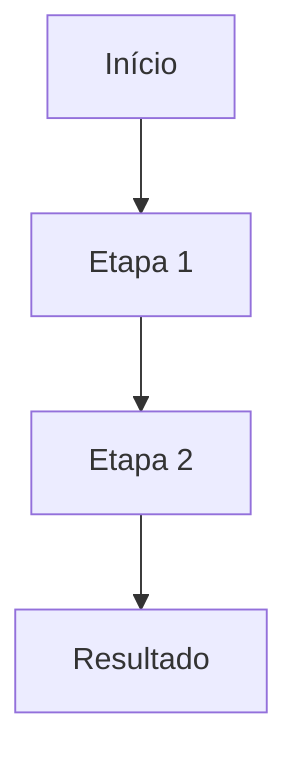

# Template de Diagrama — [Nome do Capítulo]

## Objetivo do diagrama

[O que este diagrama precisa comunicar em uma frase]

## Tipo de diagrama

[Fluxograma | Arquitetura | Sequência | Mapa mental]

## Elementos principais

- [Elemento 1]
- [Elemento 2]
- [Elemento 3]

## Estrutura (Mermaid)

## Legenda

- [Símbolo/cor] → [significado]

## Onde será usado

- [ ] Artigo do blog
- [ ] docs/
- [ ] LinkedIn
- [ ] Capa
